<h1 align="center">QUBE</h1>
<div align="center">
  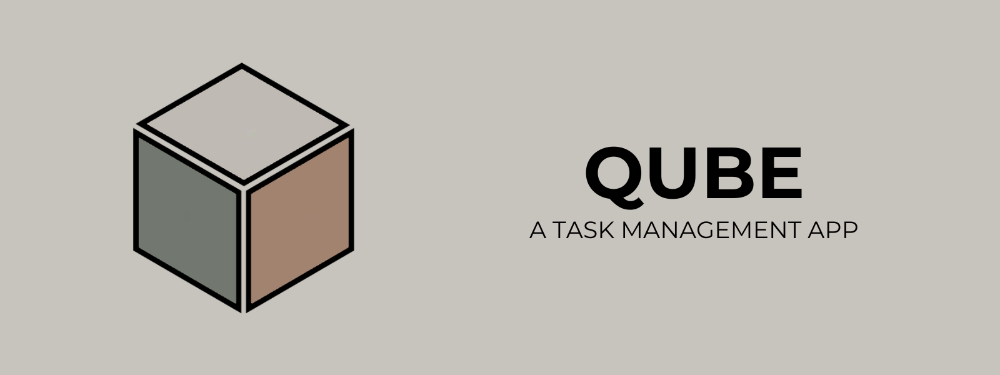
</div>

## Wprowadzenie

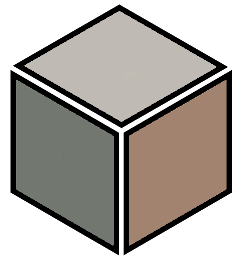

Lorem ipsum dolor sit amet, consectetur adipiscing elit. Vivamus lacinia odio vitae vestibulum vestibulum. Cras venenatis euismod malesuada. Nullam imperdiet nisi sed purus ullamcorper, non rutrum purus fermentum. Lorem ipsum dolor sit amet, consectetur adipiscing elit. Vivamus lacinia odio vitae vestibulum vestibulum. Cras venenatis euismod malesuada. Nullam imperdiet nisi sed purus ullamcorper, non rutrum purus fermentum.Lorem ipsum dolor sit amet, consectetur adipiscing elit. Vivamus lacinia odio vitae vestibulum vestibulum. Cras venenatis euismod malesuada. Nullam imperdiet nisi sed purus ullamcorper, non rutrum purus fermentum.

## Instalacja

Aby uruchomić projekt, wykonaj następujące kroki:

1. Zainstaluj bazę danych [Neo4j](https://neo4j.com/download/) i uruchom ją.
2. W pliku konfiguracyjnym Neo4j ustaw wartość `dbms.security.auth_enabled` na `false`.
3. Uruchom plik `run_project.bat` (dla systemu Windows) lub `run_project.sh` (dla systemów macOS i Linux).

Po wykonaniu tych czynności projekt samoczynnie skonfiguruje bazę i załaduje do niej niezbędne dane.

## Struktura projektu
Poniżej przedstawiono przykładową strukturę katalogu głównego projektu:

```
.
├── manage.py                 
├── 📁 qube                   
│   ├── apps.py              
│   ├── auth_utils.py        
│   ├── context_processors.py
│   ├── forms.py             
│   ├── 📁 management        
│   │   └── 📁 commands
│   │       └── seed_data.py          
│   ├── models.py            
│   ├── 📁 static            
│   │   ├── 📁 css           
│   │   ├── 📁 icons         
│   │   ├── 📁 images        
│   │   └── 📁 js            
│   ├── 📁 templates         
│   │   ├── 📁 auth
│   │   │   ├── login.html
│   │   │   └── register.html          
│   │   ├── 📁 dashboard
│   │   │   ├── create_group.html
│   │   │   ├── dashboard.html
│   │   │   └── settings.html     
│   │   ├── 📁 errors
│   │   ├── errors
│   │   │   └── 500.html        
│   │   ├── 📁 group 
│   │   │   ├── edit_member.html
│   │   │   ├── edit_task.html
│   │   │   └── group_detail.html        
│   │   ├── main.html        
│   │   └── master.html      
│   ├── 📁 templatetags      
│   │   ├── arithmetic.py    
│   │   └── dict_extras.py   
│   ├── tests.py             
│   ├── urls.py              
│   └── views.py             
├── 📁 qube_project           
│   ├── asgi.py              
│   ├── settings.py          
│   ├── urls.py              
│   └── wsgi.py              
├── run_project.bat          
├── run_project.py           
└── run_project.sh           
```

## Funkcjonalności

**Autoryzacja:**
- ✅ Logowanie
- ✅ Rejestracja
- ✅ Wylogowywanie

**Grupy:**
- ✅ Tworzenie grup
- ✅ Tworzenie lidera grupy
- ✅ Dodawanie i modyfikacja członków grupy
- ✅ Przeglądanie grup
- ✅ Przeglądanie członków grupy
- ✅ Usuwanie grupy

**Zadania:**
- ✅ Dodawanie i modyfikacja zadań w grupie
- ✅ Przeglądanie zadań

**Konto:**
- ✅ Edycja danych konta

## Przyszły rozwój

- ℹ️ Zależność zadań
- ℹ️ Przydzielanie zadań kilku członkom grupy
- ℹ️ Usuwanie zakończonych zadań
- ℹ️ Wyświetlanie szczegółów zadań w modalu
- ℹ️ Poprawa wizualna kilku elementów
- ℹ️ Przebudowa i rozszerzenie widoku ustawień 

## Galeria

<div style="text-align:center; margin-bottom:24px;">
  <div style="font-size:12px; font-style:italic; margin-top:4px;">Strona główna</div>
  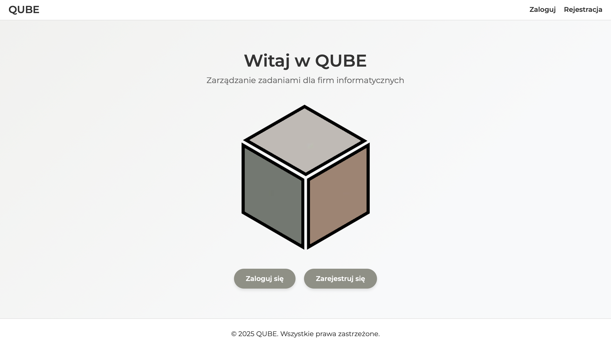
</div>
&nbsp;&nbsp;
<div style="text-align:center; margin-bottom:24px;">
  <div style="font-size:12px; font-style:italic; margin-top:4px;">Widok logowania</div>
  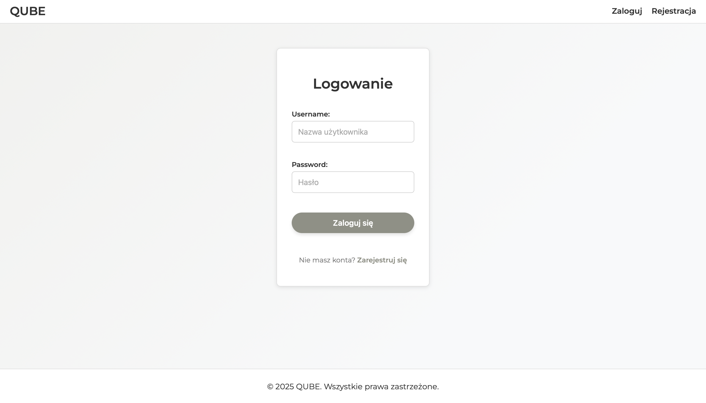
</div>
&nbsp;&nbsp;
<div style="text-align:center; margin-bottom:24px;">
  <div style="font-size:12px; font-style:italic; margin-top:4px;">Widok rejestracji</div>
  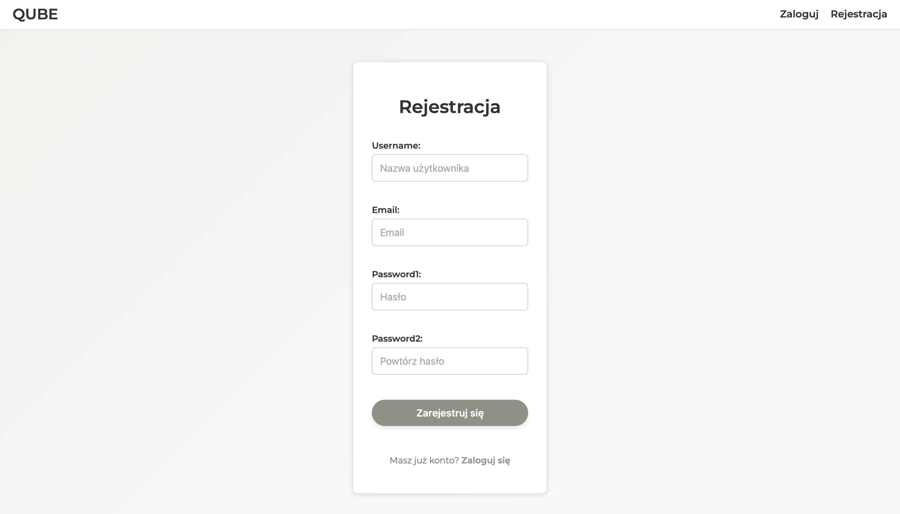
</div>
&nbsp;&nbsp;
<div style="text-align:center; margin-bottom:24px;">
  <div style="font-size:12px; font-style:italic; margin-top:4px;">Widok strony głównej użytkownika</div>
  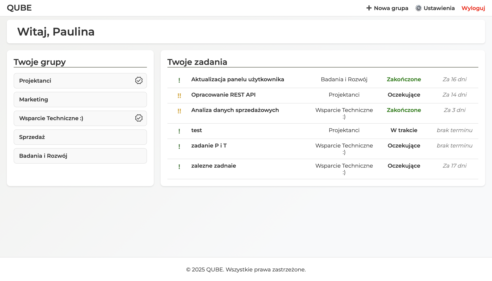
</div>
&nbsp;&nbsp;
<div style="text-align:center; margin-bottom:24px;">
  <div style="font-size:12px; font-style:italic; margin-top:4px;">Widok tworzenia grupy</div>
  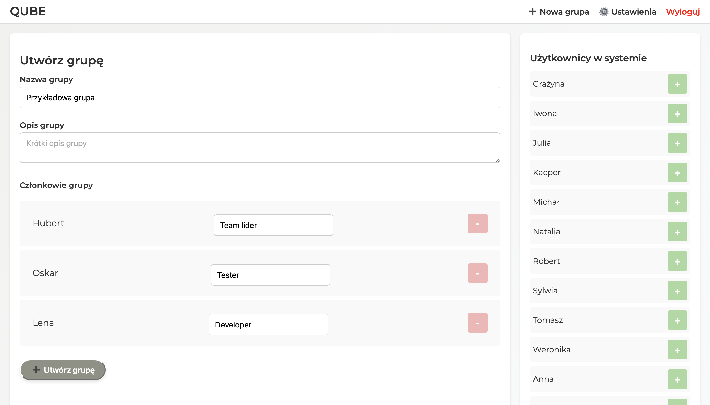
</div>
&nbsp;&nbsp;
<div style="text-align:center; margin-bottom:24px;">
  <div style="font-size:12px; font-style:italic; margin-top:4px;">Widok ustawień</div>
  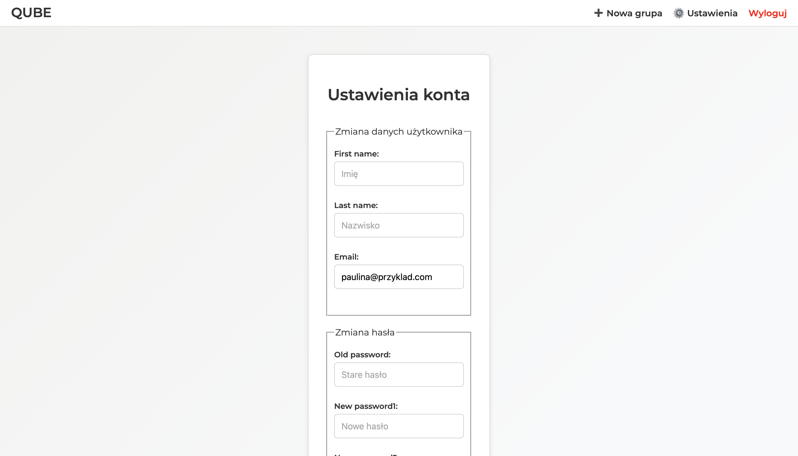
</div>
&nbsp;&nbsp;
<div style="text-align:center; margin-bottom:24px;">
  <div style="font-size:12px; font-style:italic; margin-top:4px;">Widok grupy (jako członek)</div>
  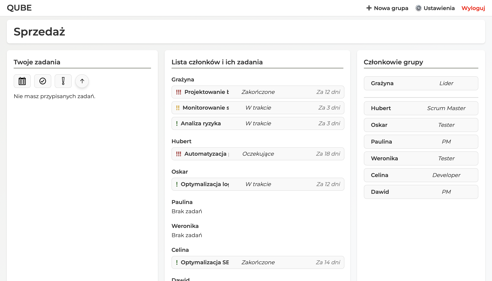
</div>
&nbsp;&nbsp;
<div style="text-align:center; margin-bottom:24px;">
  <div style="font-size:12px; font-style:italic; margin-top:4px;">Widok grupy (jako lider)</div>
  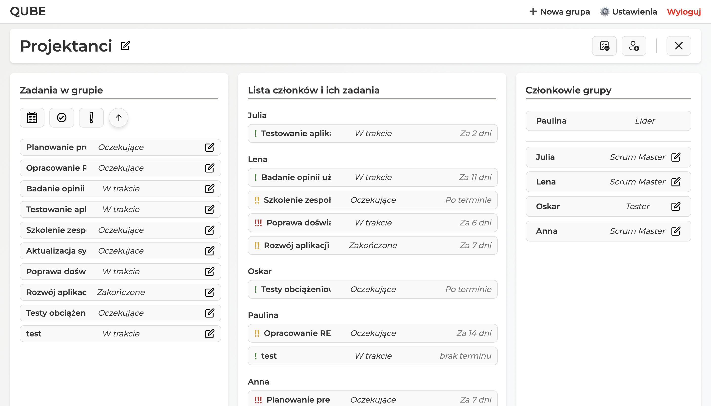
</div>
&nbsp;&nbsp;
<div style="text-align:center; margin-bottom:24px;">
  <div style="font-size:12px; font-style:italic; margin-top:4px;">Widok edycji członka</div>
  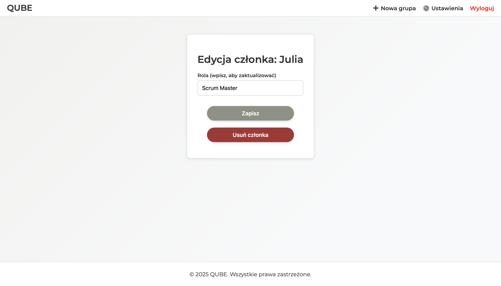
</div>
&nbsp;&nbsp;
<div style="text-align:center; margin-bottom:24px;">
  <div style="font-size:12px; font-style:italic; margin-top:4px;">Widok edycji zadania</div>
  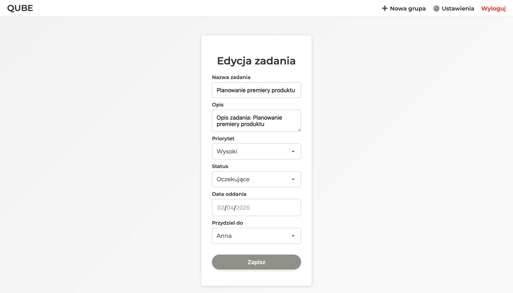
</div>
&nbsp;&nbsp;
<div style="text-align:center; margin-bottom:24px;">
  <div style="font-size:12px; font-style:italic; margin-top:4px;">Komunikat przy usuwaniu członka z grupy</div>
  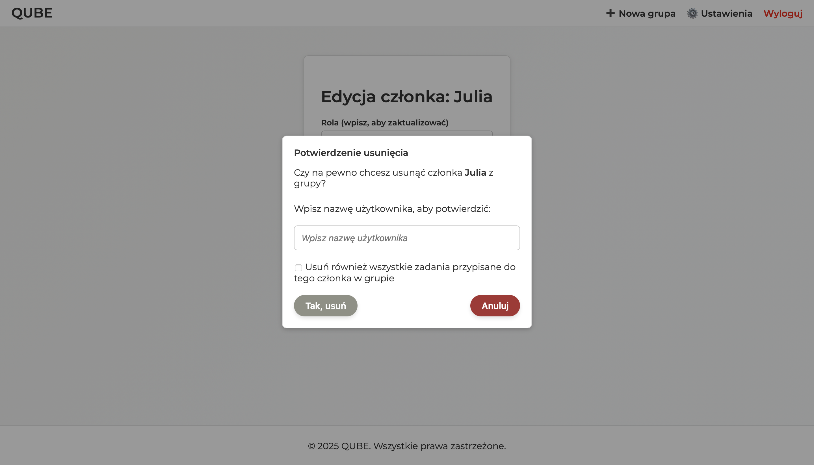
</div>

## Autorzy

- Piotr Nowak ([GitHub](https://github.com/Puegoo))
- Łukasz Solecki ([GitHub](https://github.com/soleckilukasz))
